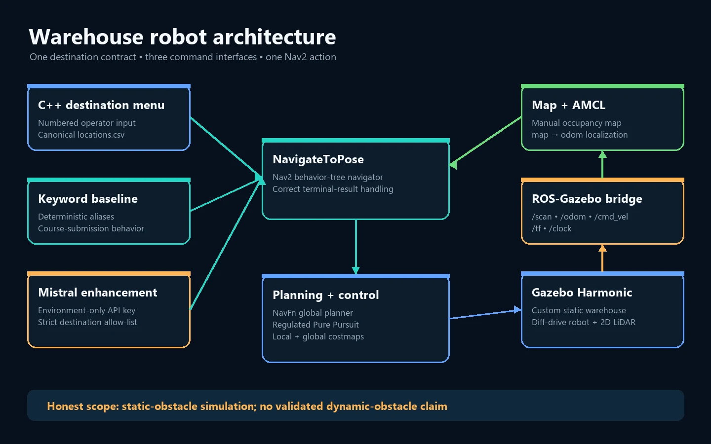
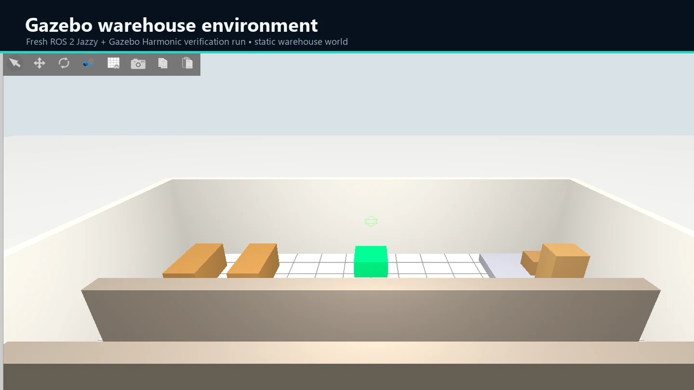
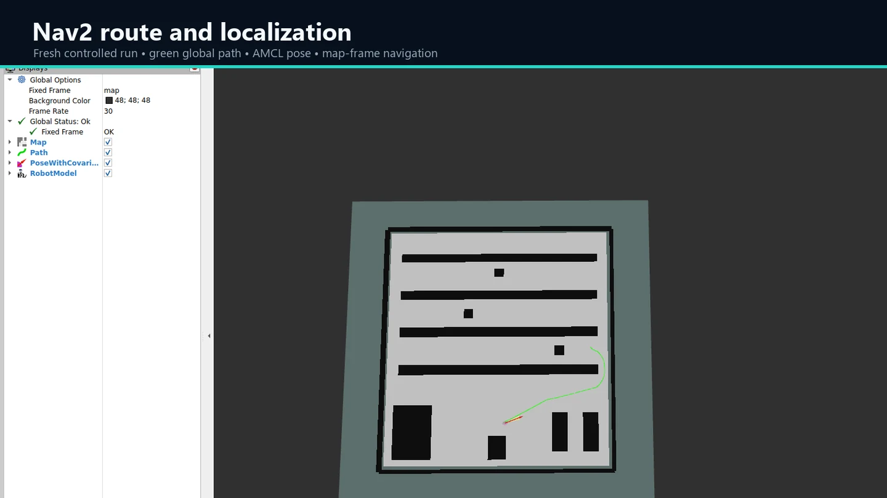
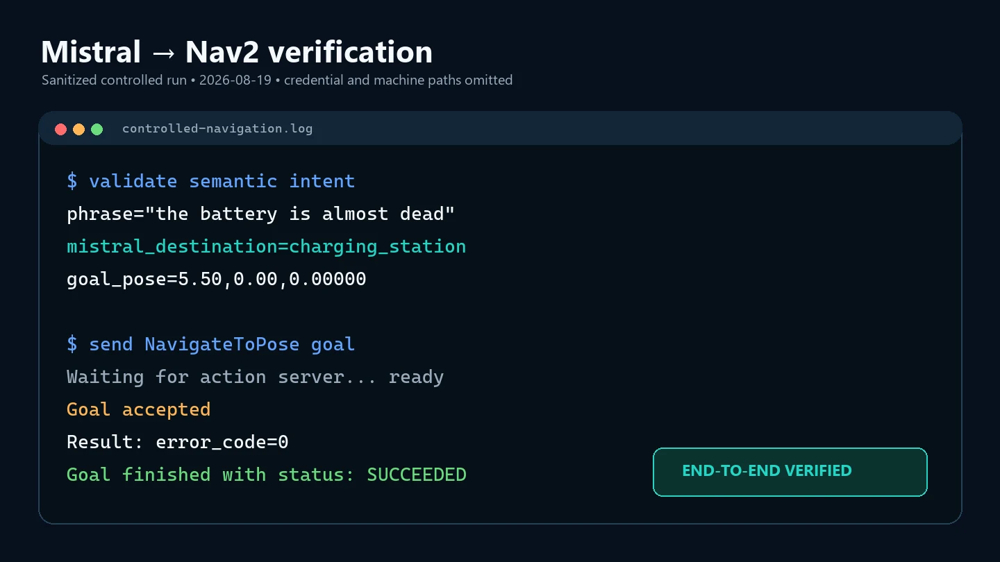

# Autonomous Warehouse Robot


[](https://docs.ros.org/en/jazzy/)
[](https://github.com/AntonIlin17/autonomous-warehouse-robot/actions/workflows/ci.yml)
[](#scope-and-limitations)

A ROS 2 simulation project for autonomous navigation between named locations in a custom warehouse. It combines a differential-drive robot, 2D LiDAR, Gazebo Harmonic, a manually created occupancy map, AMCL localization, Nav2 planning/control, and two command interfaces.

This was built as a five-person team project. Anton Ilin created the Gazebo environment, performed the manual mapping, and prototyped the Mistral-backed parser. Other contributions are attributed collectively to the project team.

## Two command layers, clearly separated

| Track | What it does | Project status |
| --- | --- | --- |
| Course baseline | Deterministic, case-insensitive matching against configured destination names and aliases | Preserves the submitted implementation model |
| Portfolio enhancement | Calls Mistral only through `MISTRAL_API_KEY`, validates the response against the destination allow-list, and falls back safely | Added after the course submission; not represented as submitted work |

The baseline executable remains available as both `keyword_nav_node` and the compatibility name `llm_nav_node`. The optional enhancement is `mistral_nav_node`.

## System at a glance



```text
Gazebo world + robot + LiDAR
        │ /scan, /odom, /tf, /clock
        ▼
Map server + AMCL ──► Nav2 planner/controller ──► /cmd_vel
                              ▲
                              │ NavigateToPose
                    C++ menu / keyword parser / Mistral enhancement
```

Seven allow-listed destinations live in one canonical file: [`locations.csv`](src/warehouse_robot_nav/config/locations.csv). The C++ menu and both Python interfaces load that same configuration, eliminating the coordinate drift found across the original prototypes.

## Verified run

| Gazebo warehouse | Nav2 planned route | Sanitized result evidence |
| --- | --- | --- |
|  |  |  |

[Watch the short WebM demonstration](showcase/media/demo.webm). The controlled run used the phrase `the battery is almost dead`, which is not a keyword alias. Mistral selected the allow-listed charging destination and Nav2 completed its goal successfully.

## Repository layout

```text
src/
  warehouse_robot_description/   # URDF/Xacro and model visualization
  warehouse_robot_sim/           # Gazebo world and ROS-Gazebo bridge
  warehouse_robot_nav/           # Nav2, map, RViz, C++ menu, canonical locations
  warehouse_robot_llm/           # Keyword baseline and Mistral enhancement
tests/                            # Portable unit and configuration tests
docs/                             # Architecture, verification, and source provenance
showcase/                         # Portfolio case study, metadata, and media
```

## Prerequisites

- Ubuntu 24.04
- ROS 2 Jazzy
- Gazebo Harmonic and `ros_gz`
- Nav2, SLAM Toolbox, Xacro, and RViz2
- Python 3.12 and `pytest` for the portable test suite

## Build and test

```bash
source /opt/ros/jazzy/setup.bash
rosdep install --from-paths src --ignore-src -r -y
colcon build --symlink-install
source install/setup.bash
python3 -m pytest
colcon test
colcon test-result --verbose
```

## Run the simulation

Use separate terminals after sourcing ROS 2 and `install/setup.bash` in each.

```bash
# Terminal 1: simulation
ros2 launch warehouse_robot_sim sim.launch.py

# Terminal 2: localization and navigation
ros2 launch warehouse_robot_nav nav2.launch.py

# Terminal 3: choose one interface
ros2 run warehouse_robot_nav nav_menu
ros2 run warehouse_robot_llm keyword_nav_node
```

Set the robot's initial pose in RViz if AMCL has not converged from the spawn pose.

## Optional Mistral enhancement

The API key is read only from the `MISTRAL_API_KEY` environment variable. Never place a key in source, launch files, shell history, screenshots, or a tracked environment file.

```bash
read -rsp "Mistral API key: " MISTRAL_API_KEY && export MISTRAL_API_KEY
echo
ros2 run warehouse_robot_llm mistral_nav_node
unset MISTRAL_API_KEY
```

The resolver accepts only configured destination IDs, names, or aliases. Unknown model output is rejected. Network, timeout, authorization, and malformed-response failures return to deterministic matching without treating a failed model response as a destination.

## Verification

The repository includes tests for:

- canonical coordinates and duplicate aliases;
- deterministic parsing, partial words, and invalid input;
- succeeded, canceled, aborted, and unknown Nav2 results;
- ROS package manifests and dependency declarations;
- relative launch/config paths and static-obstacle configuration;
- mocked Mistral success, HTTP error, timeout, malformed response, unauthorized response, allow-list rejection, and fallback.

See [`docs/verification.md`](docs/verification.md) for the exact verified commands and controlled-run evidence.

## Scope and limitations

- The simulated warehouse and its three red obstacles are static.
- Nav2's obstacle layers and LiDAR support costmap-based avoidance and replanning around sensed obstacles.
- A moving/dynamic-obstacle scenario was not implemented or validated, so this repository does not claim dynamic-obstacle performance.
- The Mistral enhancement is an optional portfolio extension, not part of the submitted course baseline.
- Simulation results do not establish real-robot safety or performance.

## Team and attribution

This is a five-person team project. Anton Ilin's documented work includes the Gazebo environment, manual mapping, and the original Mistral parser prototype. Remaining project contributions are credited collectively to the team/group members; individual teammate names are intentionally not published here.

## License status

No license has been granted yet. The `NOASSERTION` values in ROS package manifests are metadata placeholders, not a permission grant. Until the team approves a license, all rights remain with the project authors.
