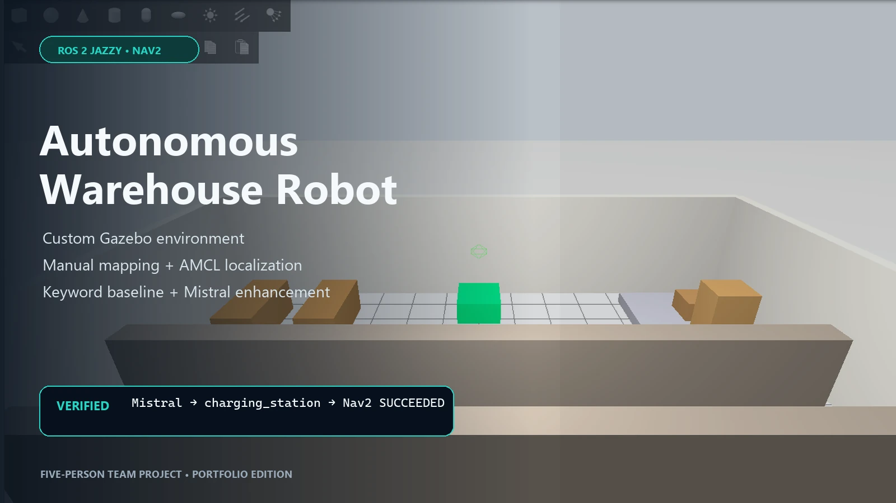

# Project showcase

This folder packages the portfolio-facing story separately from the ROS workspace.

- [`case-study.md`](case-study.md) explains the engineering decisions and verified scope.
- [`project.json`](project.json) provides machine-readable portfolio metadata.
- [`media-manifest.md`](media-manifest.md) records the provenance and privacy review for every asset.
- [`media/`](media/) contains web-ready images and the demonstration video.

The course baseline and post-course Mistral enhancement remain explicitly separated throughout the showcase.

## Media

- [Gazebo run](media/gazebo.webp)
- [RViz route](media/rviz-route.webp)
- [Sanitized command evidence](media/command-interface.webp)
- [Architecture](media/architecture.webp)
- [Short demonstration](media/demo.webm)
